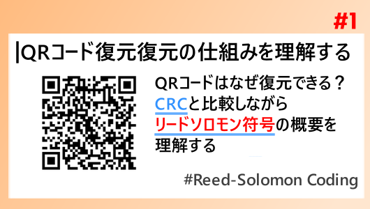

# qr-code-from-scratch

QRコードをゼロからスクラッチしていく記事シリーズ<br>
QRコードを理解する [https://tukumolog.com/qr-reed-solomon-crc/](https://tukumolog.com/qr-reed-solomon-crc/)<br>
<a href="https://tukumolog.com/qr-reed-solomon-crc/"></img></a><br>

の参考プログラムとして作成しました。<br>

*環境*
python3.12
```bash
pip3 install -r requirements.txt
```

## Step0 ガロア体の計算の基本
ガロア体の計算について、Step0のフォルダに参考となるプログラムを入れています。
### ガロア体の計算（XOR）
ガロア体における加減算にあたるものはXOR演算です。これは単純なので記事中に入れています。<br>
[デジタル世界の数学「ガロア体」を超ざっくり理解しよう！【QRコードを解読する 第2回】](https://tukumolog.com/reed-solomon-galois-field-basics/)
### ガロア体の乗法表

精製手順を表記したテーブル作成手順を0~255に対して計算した結果を確認できます。

```
python3 Step0/generate_galois_tabele_step_by_step.py
```

16進数でのテーブル作成
```
python3 Step0/generate_galois_tables.py
```

### 表を用いた演算
演算をGUI上で行うことができるシミュレータです。
```
python3 Step0/galois_cals_sim.py
```

## Step1 : "HELLO"をエンコードする。
今回対象とするQRの規格はバージョン２の誤り訂正レベルQであるので、これに合わせてリードソロモン符号を計算し実装します。

VScodeあるいは ipynbが実行可能な環境で、Hello_Encode.ipynbを開き各セルを実行してください。

詳しい内容はこちらの記事で紹介しました。


## Step2 : "HELLO"をデコードする。